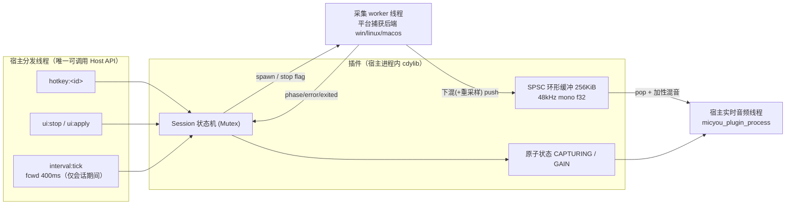
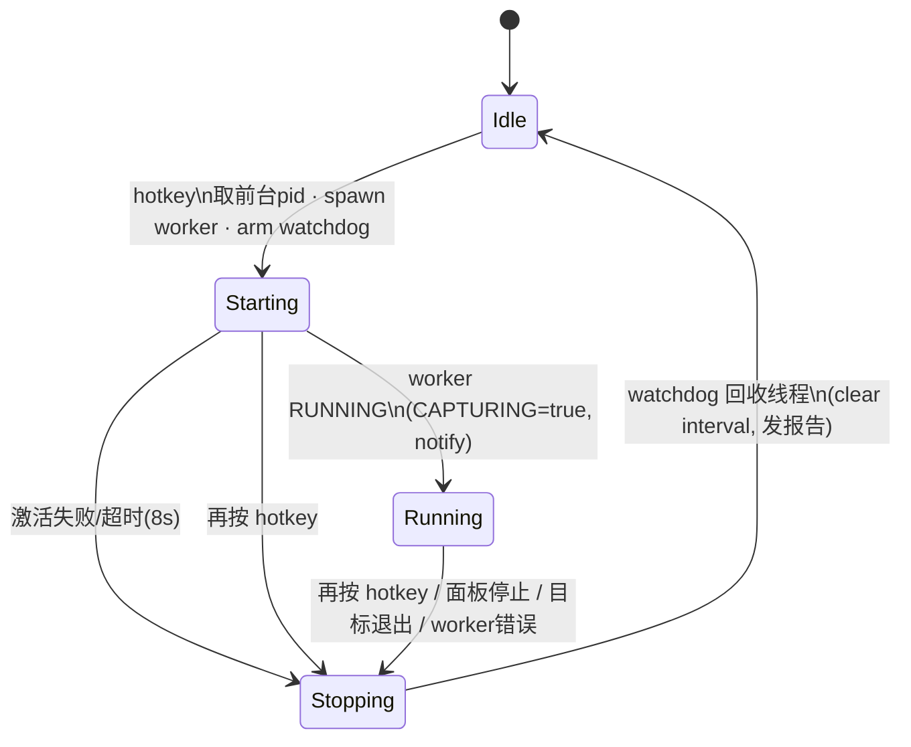

# FocusCapture 技术文档

MicYou 原生插件 `opss.focus-capture` 的完整实现说明：需求分解、宿主机制调研、Windows API 选型、**两次真机回归的根因分析**、线程模型、实时安全设计、资源审计、测试方法与跨平台可行性评估。

---

## 目录

1. [需求与目标](#1-需求与目标)
2. [宿主机制调研（实现依据）](#2-宿主机制调研实现依据)
3. [Windows 捕获 API 选型](#3-windows-捕获-api-选型)
4. [真机回归 #1：Windows 后端激活的三个 API 误用](#4-真机回归-1windows-后端激活的三个-api-误用)
5. [真机回归 #2：停止捕获时宿主闪退——COM 拆解次序 UB 与 LL 钩子的教训](#5-真机回归-2停止捕获时宿主闪退com-拆解次序-ub-与-ll-钩子的教训)
6. [总体架构与线程模型](#6-总体架构与线程模型)
7. [快捷键设计（宿主单引擎 + 运行期换键）](#7-快捷键设计宿主单引擎--运行期换键)
8. [SPSC 环形缓冲：为什么单调递增计数器 + 预分配内存是正确且无碎片的](#8-spsc-环形缓冲)
9. [实时音频路径（process）](#9-实时音频路径process)
10. [采集 worker 与 WASAPI 细节](#10-采集-worker-与-wasapi-细节)
11. [资源利用审计](#11-资源利用审计)
12. [错误处理矩阵](#12-错误处理矩阵)
13. [测试与验证](#13-测试与验证)
14. [已知限制](#14-已知限制)
15. [跨平台后端实现（Linux / macOS arm64）](#15-跨平台后端实现linux--macos-arm64)
16. [构建、发布与更新链路](#16-构建发布与更新链路)

---

## 1. 需求与目标

> 用户焦点在目标应用时按下快捷键 → 捕获**该进程**的音频输出 → 混入 MicYou 音频流；在任意位置再按同一快捷键 → 结束捕获。

| 子问题 | 方案 |
|---|---|
| 全局快捷键（焦点在任意应用都生效） | 宿主 `register_hotkey`（global-hotkey → `RegisterHotKey`，键盘组合；触发即时且不改变前台窗口） |
| 鼠标侧键 | **暂不支持**——真机回归 #2 证明插件侧 LL 钩子方案存在结构性缺陷（§5.3），计划由宿主 API 统一实现 |
| 「焦点所在进程」识别 | 按下瞬间 `GetForegroundWindow` + `GetWindowThreadProcessId` |
| 单进程音频输出捕获 | WASAPI **Process Loopback**（`VAD\Process_Loopback`，Win10 2004+，§3/§4） |
| 混入 MicYou 音频流 | 注册为 DSP 节点（`kind: dsp`），在 `micyou_plugin_process` 中做加性混音 |

平台当前仅 Windows；Linux / macOS 的可行性评估见 §15。源码保持跨平台可编译、可测试。

## 2. 宿主机制调研（实现依据）

以下结论全部来自对 MicYou 源码（master @ 2026-09）与 `docs/plugins/*` 的核对：

### 2.1 DSP 链与 process 语义

- 音频线程在 `src-tauri/src/commands/system.rs::start_server_inner` 中运行；解码后统一**重采样到 48 kHz**再进 `DspProcessor::process`。
- 插件节点是链中合成节点 `"Plugins"`；`PluginDspBridge::hook` 调用 `process_all(data, channels, 48_000, queued_ms)`——**采样率固定 48 kHz**。
- `process(data, samples, channels, queued_ms, bypass)`：`samples` 是交错 f32 总数；`bypass=1` 时宿主保留输入原样。
- 链尾对输出统一 `soft_clip`，因此插件做**线性加性混音**即可，无需自行限幅。
- `Plugins` 节点默认插在 **AEC 之后**：混入的应用声音通常同时也在扬声器播放，若在 AEC 之前混入会被回声消除吃掉。

### 2.2 快捷键路由

- `HotkeyService::register`（`src-tauri/src/plugins.rs`）：GUI 走 Tauri `global_shortcut`，headless（CLI/TUI）走 `GlobalHotKeyManager` 线程；触发后构造 `PluginMessage { topic: "hotkey:<id>" }` 投入总线 → 插件 `handle_message`。
- 底层 `RegisterHotKey` **只支持键盘**；**ABI 无 `unregister_hotkey`**（换键策略见 §7）。

### 2.3 消息分发的锁模型（重要约束）

- 总线 dispatcher 对插件实例 `Arc<Mutex<PluginInstance>>` 用 **`try_lock`**，实例忙则**丢弃消息**（日志 "skip message for busy instance"）。
- 音频线程 `process_all` 对同一把锁做**阻塞 `lock()`**。

推论：`handle_message` 内做重活会长时间持有实例锁 → 音频线程被阻塞 → 爆音，**必须微秒级返回**；快捷键消息有小概率被丢弃（宿主既有行为，面板「停止捕获」兜底）。

### 2.4 Host API 线程约束

`api-reference.md`：`init` 的 `host` 指针仅调用期间有效（必须按值拷贝）；Host API 只能在宿主分发线程（`handle_message`/定时器回调）调用；`process` 内禁止任何 Host API。本插件全部 Host API 调用只出现在 `init`/`deinit`/`handle_message`；worker 线程经原子量回传状态，由 `set_interval` 派发的 watchdog tick 代为调用 `notify`/`set_config`/`log`。

### 2.5 清单与加载

`entry` 无后缀自动补 `.dll`；产物无 `lib` 前缀；`apiVersion` 合法区间 `[1,2]`；loader 校验 `micyou_plugin_info()` 的 abi/api 版本与 id 一致性；**插件 id 只允许小写字母数字与 `.` `-`，不允许下划线**（`validate_plugin_id`）——id 为 `opss.focus-capture` 的原因。

### 2.6 双进程现实：GUI 与 CLI 会同时加载插件（回归 #2 的教训之一）

插件目录与启用状态（`plugin-state.json`）是**全用户共享**的：MicYou GUI 与 micyou-cli/TUI 同时运行时，**两个进程各自加载并 init 同一个插件**，各自维护独立的会话状态、环形缓冲与 worker 线程，并共享同一份配置文件读写。约束推论：

- `RegisterHotKey` 是全局独占的——同一组合只有一个进程注册成功，另一个得到 `hotkeyOk=false`。**键盘快捷键天然只会触发一个进程**，无双会话风险；
- 任何"每个进程都各自响应同一物理事件"的机制（如 LL 钩子）都会导致双进程同时开/停捕获——这是 §5.3 移除鼠标钩子引擎的核心原因之一；
- 两进程写同一 `plugin-state.json` 时 `fc_status` 会互相覆盖（最后写入者胜）——面板显示以本进程为准即可，无功能性影响，但值得记录。

## 3. 捕获 API 选型（Windows 本节；Linux / macOS 见 §15）

| 方案 | 结论 |
|---|---|
| **进程环回（Process Loopback）** `ActivateAudioInterfaceAsync(VIRTUAL_AUDIO_DEVICE_PROCESS_LOOPBACK)` | ✅ 采用。Win10 2004+ 官方 API，精确到进程树，无需驱动/注入 |
| 设备环回（默认扬声器 loopback） | ❌ 捕获全部声音；宿主 AEC 已占用该路径 |
| Audio Session 枚举 + metering | ❌ 只能取音量/峰值，拿不到 PCM |
| APO 注入 | ❌ 需驱动签名，复杂度不成比例 |
| `wasapi` crate | ❌ 只封装设备环回；直接用 `windows` crate 官方绑定 |

## 4. 真机回归 #1：Windows 后端激活的三个 API 误用

> 现象：真机激活失败 `HRESULT 0x80070057 (E_INVALIDARG)`（目标 firefox.exe，同权限、无 DRM）。对照微软官方样例（ApplicationLoopbackAudio，NAudio #878 引用原文）与 OBS 生产插件 bozbez/win-capture-audio 后定位三处叠加误用，全部修正。

### 4.1 激活参数必须包成 VT_BLOB PROPVARIANT（E_INVALIDARG 直接原因）

官方样例：

```cpp
PROPVARIANT activateParams = {};
activateParams.vt = VT_BLOB;
activateParams.blob.cbSize = sizeof(audioclientActivationParams);
activateParams.blob.pBlobData = (BYTE*)&audioclientActivationParams;
```

首版把 `AUDIOCLIENT_ACTIVATION_PARAMS` **裸 cast** 成 `PROPVARIANT`：引擎读到 `vt=ActivationType=1`（恰为 `VT_NULL`）、`blob.cbSize=目标 pid`（几千的"尺寸"）、`blob.pBlobData=LoopbackMode=0`（**空指针**）→ `E_INVALIDARG` 是必然结果，与目标权限/DRM 无关（首版错误文案误导了排查方向，已改为按 HRESULT 精确分诊）。

### 4.2 `GetMixFormat` 在进程环回客户端上不存在

进程环回返回的 `IAudioClient` 内部是 `AudioSes!CMixerClient`——**不绑定物理端点**，`GetMixFormat()` / `IsFormatSupported()` 返回 `E_NOTIMPL`（微软工程师在 Q&A #1125409 确认；官方样例因此硬编码格式）。修正为**调用方自定格式**，引擎负责把目标进程音频重采样/混音到该格式：

| 优先级 | 格式 | 依据 |
|---|---|---|
| 1 | 48 kHz · stereo · float32 | 与 OBS win-capture-audio 相同；与宿主 DSP 链同采样率 → 插件重采样器完全不参与 |
| 2（回退） | 44.1 kHz · stereo · PCM16 | 微软样例硬编码并背书"safe"；走插件内 8-tap 窗 sinc 重采样 |

### 4.3 `Initialize` 必须带 `AUDCLNT_STREAMFLAGS_LOOPBACK`

首版只传 `EVENTCALLBACK`；OBS 实现证实需要 `LOOPBACK | EVENTCALLBACK`。缓冲时长取 1 s（OBS 用 5 s；共享模式下引擎按 period 圆整，大缓冲容忍消费端停顿，延迟钳制由插件环形缓冲负责，§8）。

## 5. 真机回归 #2：停止捕获时宿主闪退——COM 拆解次序 UB 与 LL 钩子的教训

> 现象（用户实测，wmplayer.exe）：第一次按键启动捕获正常、混音正常；**第二次按键（停止）后 ~2s 内**：GUI 窗口消失（tauri 进程仍存活并继续写日志）、全系统鼠标移动卡顿约 2 秒、CLI 前端数秒后退出。日志时序：`capture stop requested` @:51 → 窗口消失 @~:53 → `skip message for busy instance` @:56（无 GUI 状态下）。

### 5.1 确认的根因：堆损坏（`0xC0000374`）——windows-rs `PROPVARIANT` 的 Drop 陷阱

回归 #3 引入的 FC_TRACE + VEH 一次现场即实锤：

```text
[fc …64871 tid=3] worker: leaving packet loop (stop flag=true)
[fc …64873 tid=3] !!! UNHANDLED EXCEPTION code=0xc0000374 address=0x7ffeb94f0d21 module=ntdll.dll
```

`0xC0000374 = STATUS_HEAP_CORRUPTION`，发生在 worker 线程**离开 packet loop 之后、且没有任何 `teardown:` 行**的位置——即作用域退出析构的早期。因果链：

1. 官方样例要求把 `AUDIOCLIENT_ACTIVATION_PARAMS` 包成 `VT_BLOB` 的 `PROPVARIANT`，`blob.pBlobData` 指向**栈上**结构体（§4.1）；
2. C++ 里 `PROPVARIANT` 是**无析构函数的 POD**，样例因此安全；而 **windows-rs 绑定为 `PROPVARIANT` 实现了 `Drop` → `PropVariantClear`**，对 `VT_BLOB` 类型该函数会 **`CoTaskMemFree(pBlobData)`**——释放一个栈指针 = 堆损坏；
3. 析构发生在 `run_capture` 作用域退出时（逆序析构中 `activate_params` 早于 `Cleanup`，故 `teardown:` 追踪行从未打印）——**因此三次回归全部表现为"停止捕获时崩溃"**，启动路径不触发；
4. 堆损坏的后续行为不确定（ntdll 堆管理器的损坏处理、栈回溯、按线程/进程随机显现）：GUI 窗口消失而进程存活、CLI 退出、约两秒的全系统卡顿（损坏处理拖住进程与输入管线），都是同一根因的不同表现。

### 5.2 修复：`StackBlobPropVariant` RAII 守卫

```rust
struct StackBlobPropVariant(PROPVARIANT);
impl Drop for StackBlobPropVariant {
    fn drop(&mut self) { unsafe { (&mut *self.0.Anonymous.Anonymous).vt = VT_EMPTY; } }
}
```

守卫的 Drop 体先把 `vt` 置为 `VT_EMPTY`（`PropVariantClear` 对其为 no-op），随后内层 `PROPVARIANT` 自身的 Drop 才运行——**所有退出路径（含早退错误返回）都经 RAII 覆盖**，栈 blob 永远不会被 `CoTaskMemFree`。实现细节：`ManuallyDrop` 联合字段禁止隐式 place 解引用赋值，必须显式 `&mut *` 解引用后写字段。

验证方式：修复后真机 trace 应出现完整 `teardown:` 行序列与 `worker: thread exit (phase->FINISHED)`，且 watchdog 正常 `reap_worker: joined`；停止→再启动循环不再崩溃。

### 5.3 排查途中的独立加固（保留）

- **COM 拆解次序**（原怀疑根因）：`CoUninitialize` 必须严格最后，`IAudioClient` 的 Release 在其之前（`client.take()`）；`buffer_event` 在会话释放后才关闭。这本身是真实 UB 隐患，虽非本次崩溃元凶，作为铁律保留；
- 激活事件句柄由完成回调对象持有、COM 引用清零时才关闭（防晚到回调打到回收句柄）。

### 5.4 结构性决策：移除插件侧鼠标 LL 钩子引擎

首版鼠标侧键支持的 `WH_MOUSE_LL` 引擎存在两个与本次崩溃无关但独立成立的缺陷：LL 钩子**按进程各自生效**（GUI+CLI 双进程对同一次按下双重 toggle——回归 #2 日志中 CLI 停止的同时 GUI 开新会话，即是此因）；持钩子进程死亡时系统重建全局钩子链会拖住输入。鼠标监听改由宿主 API 统一实现（§7）。

### 5.5 回归 #2/#3 的验证

- teardown 次序修复后，Windows 侧手动清单重点复测：启动→停止→再启动→停止 ×10 轮、停止瞬间关闭目标应用、GUI+CLI 双进程同时运行下的完整循环。

## 6. 总体架构与线程模型



| 线程 | 职责 | Host API | 分配 | 锁 |
|---|---|---|---|---|
| 宿主分发线程 | 状态机、watchdog、全部 Host API | ✅ 仅此处 | 允许 | SESSION Mutex |
| 采集 worker | WASAPI 采包、格式转换、ring 生产 | ❌ | 稳态零 | 无（SPSC） |
| 宿主音频线程 | ring 消费、包络、混音 | ❌ | **零** | **零** |

会话状态机：



停止听感即时（`CAPTURING=false` → 10ms 淡出），线程回收异步完成；`deinit` 对 worker 做**强制有界 join**（库即将解除映射，任何仍在执行 DLL 代码的线程都会导致崩溃）。

## 7. 快捷键设计（宿主单引擎 + 运行期换键）

- **注册**：init 时先经 `hotkey::parse` 前置校验（词汇对齐 global-hotkey：修饰键 + a–z/0–9/f1–f24/常用命名键；裸字母数字拒绝，防系统级劫持打字；鼠标 token 给出"暂不支持、计划宿主 API 提供"的精确错误），再 `register_hotkey`。解析失败时仍试注册一次（宿主 parser 或认识更多别名）。
- **触发过滤**：`handle_message` 仅接受 `hotkey:<id>` 且 `id == 当前生效句柄` 且注册仍激活——外来句柄与过期句柄一律忽略（单元测试与真机回归覆盖）。
- **运行期换键**（无需重载插件）：面板/表单改配置 → `ui:apply` → `plan_hotkey` 重规划：向宿主注册**新**组合、把生效句柄切到新 id——旧注册因 ABI 无 unregister 而滞留宿主，但消息按 id 过滤即刻失效；**A→B→A 往返会复用仍持有的旧注册**（不重复注册）。
- **面板按键捕获**：iframe 内 `keydown` 按 `e.code` 映射回快捷键词汇（`KeyA→a`、`F8→f8`、`ArrowUp→up`…），修饰键取自 `e.ctrlKey/altKey/shiftKey/metaKey`，Esc 取消，写入 `set_config` + `trigger apply` 即时生效。

## 8. SPSC 环形缓冲：为什么单调递增计数器 + 预分配内存是正确且无碎片的

（对应 `src/ring.rs`；完整回答"内存是否预分配、会不会碎片化、为什么这样能工作"。）

### 8.1 内存：一次分配，终身不动

```rust
buf: UnsafeCell<Vec<f32>>   // init 时 vec![0.0; 65_536]，256 KiB 连续内存
```

- 整块缓冲在 `init` 里**一次性分配**（48kHz mono 约 1.37 秒），此后**永不扩容、永不释放、永不逐样本分配**——生产/消费只是在既有槽位上拷贝。
- 因此**结构上不存在运行时碎片**：碎片化来自"频繁申请/释放不同大小的小块"，这里整个生命周期只有一次 alloc（+卸载时一次 free）。这正是实时音频的标准手法——所有可能分配的操作都被赶到非实时线程/初始化阶段。
- 对比备选：`Mutex<VecDeque>`（每帧可能扩容+锁）、`crossbeam` 队列（逐元素原子操作、内部块分配）——都不满足音频线程"零分配零锁"硬约束。

### 8.2 单调递增计数器：用"绝对时间轴"替代"槽位下标"

经典环形缓冲的痛点：读写指针取模回绕后，`r == w` 既可能空也可能满，通常浪费一个槽或引入标志位。本实现让 `read`/`write` 保存**从不回绕的绝对样本序号**，槽位下标在访问瞬间才计算：

```text
slot(pos)   = pos & (CAP - 1)        // CAP 为 2 的幂，& 即取模，一条 AND 指令
available() = write - read           // 待读样本数
free()      = CAP - (write - read)   // 剩余空间
```

- **空/满天然无歧义**：空 ⟺ `w == r`；满 ⟺ `w - r == CAP`。不浪费槽位、不需要 CAS 标志。
- **减法永远正确**：即使 64 位计数真溢出回绕（48kHz 下需连续运行约 **1200 万年**），补码 `wrapping_sub` 依然给出正确差值——与 Linux kfifo 同一原理。
- **单调性消除 ABA**：位置只前进，消费者不可能"追上"生产者造成歧义。

### 8.3 为什么无锁是安全的：单写者原则 + Release/Acquire

两条不变量支撑整个设计：

1. **每个原子计数只有一个写者**：`write` 只被采集线程写，`read` 只被音频线程写。单写者意味着写自己那侧只需 `Relaxed`，不存在写-写竞争。
2. **样本区间永不重叠**：生产者只写 `[w, w+n)`（free 区），消费者只读 `[r, w)`（available 区）；`w - r ≤ CAP` 恒成立 → 两区间在环上不相交，**同一槽位不会同时被一读一写**。

跨线程可见性由一对内存序保证（"为什么能工作"的核心）：

```text
生产者:  写样本到槽位 …… → write.store(w+n, Release)
                                    ┆ release/acquire 同步点
消费者:  write.load(Acquire) → 读样本 …… → read.store(r+take, Release)
```

- `Release` 保证 store 之前的**所有样本写入**对做 `Acquire` load 的线程可见（禁止把样本写重排到指针发布之后）；
- 消费者 `Acquire` 读到新 `write` 后才读那些槽位——读到的必然是写完的数据；
- 反方向同理：生产者 `Acquire` 读 `read` 之后才把对应槽位当 free 覆写。

于是**每帧只需 2 次原子 load + 1 次原子 store**，中间上千个样本全是普通内存读写。两个计数各自独占一次缓存行往返（每 20ms 帧一次，纳秒级）；批量语义让 false sharing 无关紧要（若追求极致可做缓存行填充，收益在此帧率下不可测量）。

### 8.4 溢出与延迟钳制：两侧各管一头

- **生产侧满 → 丢最新**（`dropped` 计数）：只在消费者缺席（未串流）时发生；
- **消费侧陈旧 → 丢最旧**（每帧先跳过超过 300ms backlog 的旧样本）：暂停串流 10 分钟再恢复，混入的也是**最新**声音。丢最旧只能由消费者做（它是 `read` 唯一写者），依然无锁无竞争。

### 8.5 生命周期边角

`clear()`（`read` 对齐到 `write`）只允许在 `CAPTURING == false`（音频线程不消费）时由总线线程调用——会话启动前与卸载时；此时生产者尚未存在或已停止。`init`/`deinit` 与音频线程无并发（宿主 DSP 注册/注销与 `process_all` 之间读写锁互斥），包络复位同理安全。

## 9. 实时音频路径（process）

```text
micyou_plugin_process(data, samples, channels, queued_ms, bypass)
├─ 参数校验（null/0 → bypass + INVALID_ARG）
├─ active = CAPTURING.load(Acquire)
├─ !active && env<=0 → *bypass=1, return          ← 空闲快速路径（≈一次原子读）
├─ gain = f32::from_bits(GAIN_BITS.load(Relaxed))  ← 配置无锁热更新
└─ ring.mix_mono_into(data, frames, channels, backlog=300ms, coef)
    ├─ 一次 Acquire load(write)；先丢弃超 backlog 的最旧样本
    ├─ 每样本回调 coef：包络向目标推进 1/480（10ms 斜坡），返回 gain*env
    ├─ 交错数据逐帧把 mono 样本加到全部声道（两段式处理回卷，零中间缓冲）
    └─ 一次 Release store(read += take)
├─ 淡出期 ring 抽空 → 按剩余帧数推进包络，10ms 内归零、bypass 复位
└─ *bypass = 0
```

对照实时条款：零堆分配、零 Host API、零锁、单帧 ≪1ms、异常经 `catch_unwind` 收敛为错误码。采样率不匹配（回退格式 44.1kHz）由 worker 侧 8-tap Hann 窗 sinc（512 相位表，16KiB）处理，音频线程永远只见 48kHz mono。

## 10. 采集 worker 与 WASAPI 细节

`src/capture.rs`（`cfg(windows)`；其余平台为可编译降级桩）：

- **COM**：线程内 `CoInitializeEx(MTA)`；激活完成回调用 `#[implement]` 实现（windows 0.62：trait 实现于生成的 `X_Impl` 包装，Deref 访问字段），回调仅 `SetEvent`；**完成事件句柄由 handler 对象持有、在其 COM 引用清零时关闭**（晚到的 `ActivateCompleted` 不会打到已回收句柄）。
- **激活**：VT_BLOB 包装（§4.1）→ 等待完成事件（5s 上限）→ `GetActivateResult` 双重检查，按 HRESULT 精确分诊（§12）。
- **格式**：调用方自定（§4.2），`Initialize(SHARED, LOOPBACK|EVENTCALLBACK, 1s, fmt)`，float32@48k → PCM16@44.1k 依序回退。
- **事件循环**：auto-reset 事件 + 100ms 超时兜底；每轮排空全部 packet；silent 包按帧数推零保持时间轴连续；discontinuity 计数并在会话结束写日志。
- **目标存活**：`OpenProcess` 句柄带 `SYNCHRONIZE`，循环中零超时等待判定退出 → 自动收尾。
- **权限预检**：激活前先 `OpenProcess(QUERY_LIMITED_INFORMATION)`——提权目标立刻得到"以管理员运行"的可操作提示。
- **拆解次序（§5.1 修复）**：`Stop → client.take()（Release）→ CloseHandle(buffer_event) → CloseHandle(proc) → CoUninitialize 严格最后`；`IAudioCaptureClient` 等局部 COM 对象靠声明顺序天然先于 `Cleanup` 析构；早退（`?`）路径同样满足该次序。
- **样本转换**：`GetBuffer` 指针按 WASAPI 保证 DWORD 对齐 → f32/i16 零拷贝切片，逐帧下混 mono（平均值语义），scratch 复用（稳态零分配）。

## 11. 资源利用审计

| 资源 | 空闲（未捕获） | 捕获中 |
|---|---|---|
| 线程 | 0（无自建线程；钩子引擎已移除） | 1 个 worker（事件驱动，无忙等） |
| 定时器 | 0（watchdog interval 会话结束即 clear） | 1 × 400ms |
| 内存 | ring 256 KiB + 状态若干百字节 | + worker scratch ~8 KiB + 相位表 16 KiB（仅回退格式）+ 引擎侧 1s 缓冲 |
| Host API | 0 | 状态变化各一次 set_config/notify；每 5 tick（2s）复读配置 |
| 音频线程/帧 | 1 次原子 load（bypass 路径） | 2 load + 1 store + O(frames) FMA |

延迟预算：引擎事件回调 ~10–40ms + ring 稳态水位 ≤300ms（实际 ≈ 生产批量 10–40ms）+ 宿主帧 20ms ≈ **50–100ms 典型混音延迟**。

## 12. 错误处理矩阵

| 故障 | 检测点 | 用户可见反馈 |
|---|---|---|
| 快捷键解析失败（含鼠标 token） | init / apply | 面板红字：精确原因（如"鼠标侧键暂不支持"）+ `hotkeyOk=false` |
| 宿主注册失败（冲突等） | init / apply | 面板红字 + 日志 |
| 无前台窗口 / 前台是 MicYou 自身 | 触发时 | 通知说明原因（自身→回声反馈风险） |
| OpenProcess 拒绝（目标提权） | worker 启动 | 通知含"以管理员运行"指引 |
| 激活失败 `0x80070005` | GetActivateResult | 「拒绝访问：目标更高权限或 DRM 保护」 |
| 激活失败 `0x80070057` | 同上 | 「系统音频服务异常」（VT_BLOB 修正后指向环境而非插件） |
| 激活失败 `0x80070490` | 同上 | 「未找到目标音频端点…确认 ≥ Win10 2004」 |
| 激活等待超时（5s）/ 启动超时（8s） | worker / watchdog | 「激活超时」 |
| Initialize 两种格式均失败 | worker | 「音频引擎异常」 |
| 采集循环 COM 错误 | worker | 「捕获中断」+ HRESULT |
| 目标进程退出 | 存活监测 | 「目标应用已退出，捕获自动停止」 |
| worker 卡死 | watchdog / deinit | 有界回收 + 日志（不无限阻塞卸载） |
| 插件内部 panic | 所有 FFI 入口 | `catch_unwind` → `MPL_ERR_RUNTIME`，不波及宿主 |

所有通知受 `notify` 开关控制；错误同时写 `fc_status.error`（面板）与宿主插件日志。

## 13. 测试与验证

### 13.1 单元测试（`cargo test --release`，13 项，CI 在 Windows 上跑）

- ring：往返一致、回卷无缝、满时丢新计数、消费端 backlog 丢旧保尾、立体声上混；
- 重采样：恒等比、44.1→48k 长度/RMS、96k→48k 预抽取、分块 vs 整体一致性（≤5e-4，来源为相位表量化）；
- 快捷键解析：组合/VK 映射/裸字母拒绝/重复主键拒绝/**鼠标 token 精确报错**。

### 13.2 现场诊断工具（FC_TRACE，回归 #3 引入）

宿主日志粒度（每个状态变更一行）不足以定位停止路径上的崩溃，因此加入可选追踪层（`src/trace.rs`）：

- `FC_TRACE=1` 时，`fctrace!` 在总线/worker 线程的每个关键步骤输出 `[fc <墙钟ms> tid=<线程>] …` 到 stderr **与** `%TEMP%\focuscapture-trace.log`（GUI 为 windows-subsystem 进程、无控制台，文件槽保证崩溃现场可回收；绝不从实时音频线程调用）；
- 同条件下安装 **vectored exception handler**：崩溃时打印异常码、`ExceptionAddress` 及经 `GetModuleHandleExW(FROM_ADDRESS)` 解析出的**模块名**后继续搜索（不改变崩溃行为），一行即可区分"故障在本 DLL"还是"在 AudioSes/mmdevapi/ntdll/宿主模块"；
- 未开启时 `enabled()` 为一次 `OnceLock` 读取，生产零开销。

### 13.3 Windows 真机清单（回归 #2 后重点）

1. 启动→停止→再启动→停止 **×10 轮**（拆解路径压力）；
2. 停止瞬间/捕获中关闭目标应用；
3. **GUI + CLI 双进程**同时运行时全流程（验证仅一进程持有快捷键、无双会话）；
4. firefox / wmplayer / 游戏各测一轮（多进程树应用）；
5. 提权目标 + 普通权限 MicYou → 权限错误提示；
6. 串流暂停 1 分钟恢复 → backlog 钳制生效；
7. 禁用/重启用插件 → 无线程残留。

## 14. 已知限制

1. **Windows 10 2004+**：更早系统无进程环回 API。
2. **鼠标侧键不支持**：见 §5.3，等待宿主 API 扩展。
3. **独占模式流捕获不到**（WASAPI Exclusive 绕过引擎）；**DRM 内容**被系统拒绝。
4. **宿主总线 try_lock 丢消息**：快捷键触发有小概率被跳过（§2.3），再按一次即可；面板可兜底停止。
5. **旧宿主快捷键注册无法运行期释放**（ABI 无 unregister）：改键后旧注册滞留（消息按 id 过滤、行为无影响），插件禁用/宿主重启时释放。
6. **GUI+CLI 双进程**：`fc_status` 互相覆盖（最后写入者胜）；快捷键全局独占故捕获会话只会存在于一个进程（§2.6）。
7. **混音为 mono**：宿主链路本质单声道，立体声下混（平均）属预期。
8. **捕获≠串流**：`process` 仅在宿主音频线程运行时被调用；未连接设备时声音不送达（状态照常切换）。
9. MSVC 产物依赖 UCRT/VCRUNTIME140（Rust MSVC 目标常态）；宿主本身即 MSVC 构建并携带该运行时，部署无额外要求。

## 15. 跨平台后端实现（Linux / macOS arm64）

三平台共用同一契约（`capture.rs` 分发）：`foreground_pid() / process_name_by_pid() / spawn_worker(pid, ring, stop, shared, capturing)`；共享 `convert_interleaved_to_mono`（Windows/Linux）与 `resampler_for`/`engage_capturing`。状态机、环形缓冲、混音、watchdog、面板全部平台无关。

### 15.1 Linux：PipeWire 流间捕获（`backend_linux.rs`）

- **目标节点发现**：连接 PipeWire → `registry.add_listener_local().global(...)` 枚举全局对象，筛选 `media.class == "Stream/Output/Audio"` 且 `application.process.id == <pid>` 的节点（即目标应用正在发声的输出流）；2s 超时内用 `main_loop.loop_().iterate(50ms)` 驱动枚举。应用未发声 → 明确报错（不做 PulseAudio 兜底，见 README 平台表）。
- **捕获**：`Stream::new(&core, name, props)` 后 `stream.connect(Direction::Input, Some(node_id), AUTOCONNECT|MAP_BUFFERS, &mut [])`——把捕获流**直接连到目标流节点 id**（PipeWire 官方流间链接语义，输出端口可扇出到多个消费端），不改动用户路由、不建 null-sink。
- **格式协商**：`param_changed(SPA_PARAM_Format)` 回调中解析协商结果。libspa 的便利迭代器 `spa_pod_parser_prop()` 是 C `static inline`、bindgen 不导出，故按 object-pod 的稳定二进制布局手工遍历（`[size,type,obj_type,n_props,props...]`，每 prop `[size,type,key,flags,value]`，8 字节对齐推进）——约 40 行、零依赖、可单测验证布局常量。
- **数据路径**：process 回调 `dequeue_buffer()` → `datas_mut()[0]` 的 `chunk().size()/offset()` + 映射字节 → 共享下混 → 必要时 sinc 重采样 → ring。停止：外层 `iterate(100ms)` 循环检查 stop 标志或回调置位的 quit。
- **前台识别**：X11 `_NET_ACTIVE_WINDOW` + `_NET_WM_PID`（x11rb 纯 Rust）。Wayland 合成器不暴露前台 pid，且宿主 `register_hotkey` 本就仅 X11——功能边界自洽，Wayland 下给出精确报错。
- 构建依赖：`libpipewire-0.3-dev libspa-0.2-dev`（pkg-config）+ `libclang-dev`（libspa-sys 经 bindgen 生成绑定）；CI ubuntu runner 已覆盖。

### 15.2 macOS arm64：CoreAudio Process Tap（`backend_macos.rs`）

- **仅官方 API、仅 14.4+**：`CATapDescriptionCreate` → `CATapDescriptionSetProcessIDs(CFArray[pid])` → `AudioHardwareCreateProcessTap` → tap 表现为一个**输入设备**：查询 `kAudioDevicePropertyStreamFormat`（Float32、交织/非交织、采样率、声道）→ `AudioDeviceCreateIOProcID` + `AudioDeviceStart` 读取；不做 ScreenCaptureKit（避免"屏幕录制"TCC 权限与复杂度），不为老系统绕弯。
- **运行时符号探测**：四个 14.4+ 符号用 `dlsym(RTLD_DEFAULT, ...)` 在捕获开始时解析；缺失即报"需要 macOS 14.4 或更新"——插件在更老系统上仍能**加载**（dlopen 不链接这些符号），错误信息精确。
- **IO proc 数据路径**：非交织时逐声道 buffer 平均成 mono；交织时按声道步长平均；Float32 假设经 format flags 校验（非 float 直接拒绝）；采样率 ≠48k 时走共享 sinc 重采样。停止：外层 50ms 轮询 stop → `AudioDeviceStop` → `DestroyIOProcID` → `AudioHardwareDestroyProcessTap` → 归还 state Box。
- **前台识别**：raw objc（`objc_getClass/sel_registerName/objc_msgSend` 转型调用）读 `NSWorkspace.frontmostApplication.processIdentifier`——无需 AppKit crate。
- 验证方式：沙箱无 macOS SDK 链接能力，采用 `cargo check/clippy --target aarch64-apple-darwin` 全量类型检查（0 警告）；真机行为留待 CI macos runner 与实机回归（清单：14.4/15.x 各一，播放器与浏览器各一，停止/目标退出/切前台重捕）。

### 15.3 平台矩阵与验证现状

| 平台 | 运行时验证 | 编译验证 |
|---|---|---|
| Windows x86_64 | ✅ 真机多轮回归（含两次崩溃复盘与修复确认） | MSVC（xwin/CI）+ mingw 交叉 |
| Linux x86_64 | ⚠️ 容器内真实 PipeWire 会话（dbus + pipewire daemon + 伪应用流，仓库外 
## 16. 构建、发布与更新链路

- **CI（`.github/workflows/release.yml`）**：push（main/dev）→ 三平台原生矩阵构建（windows-latest MSVC / ubuntu-latest + PipeWire 与 libclang / macos-latest arm64）→ 各跑 `cargo test` → 产物去 `lib` 前缀 → **单包含三库** `plugin.zip` → 覆盖发布滚动 prerelease `development` + Actions artifact；push 到 main 额外 bump patch（提交带 `[skip ci]` 防自触发）→ tag `v<ver>` → 正式 release（资产 `plugin.zip`、版本化 zip、`plugin.json`）。
- **宿主内更新**：manifest `updateUrl` 指向 `releases/latest/download/plugin.json`；宿主 `update_plugin` 拉取远端 manifest 比对 semver 后，把该 URL 的 `.json` 替换为 `.zip` 推导下载地址（`src-tauri/src/commands/plugins.rs`）——因此 release 资产**固定命名** `plugin.json` + `plugin.zip`。manifest 另含非宿主字段 `downloadUrl`（serde 忽略，供市场索引/人工阅读）。
- 仓库：`https://github.com/OrientCOMPASS/Focus-Capture`。
